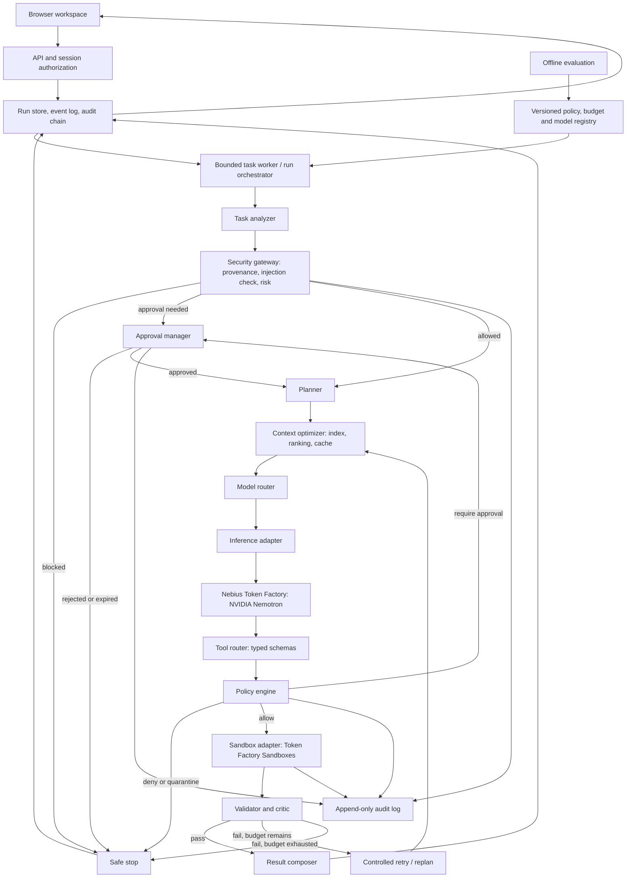
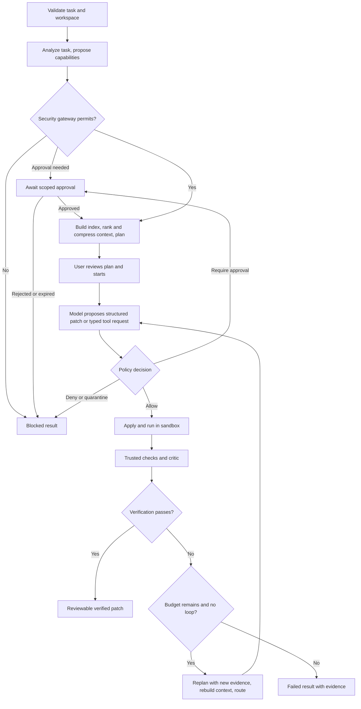
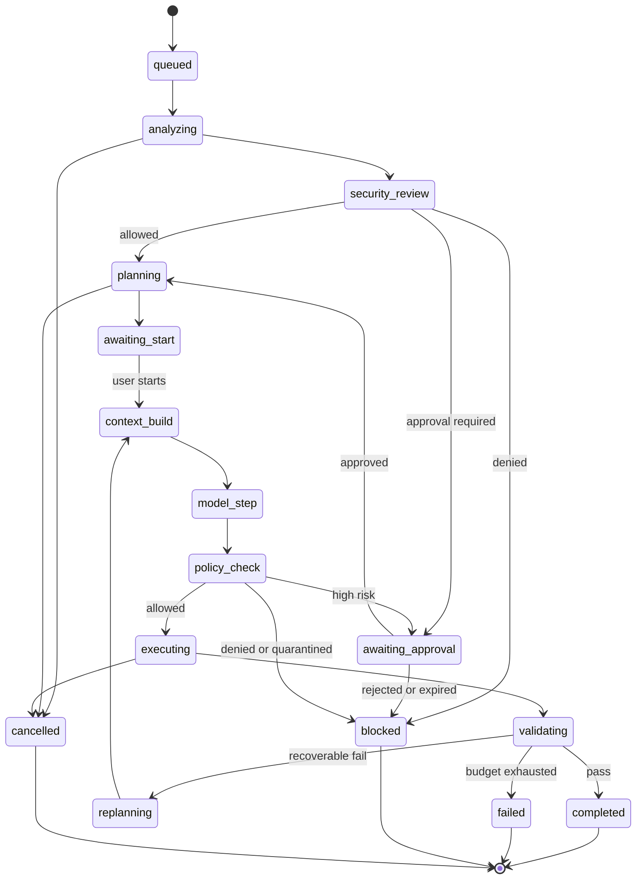

# Nexora — Application Flow and Architecture

Version: 3.0 | Updated: 3 October 2026 | Proposed architecture, not a claim of implemented software

The filename follows the requested spelling. Related documents: [PRD](prd.md), [Rules](rules.md), [Phases](phases.md), [Design](design.md).

Sources merged in this version: the v2.0 hackathon architecture, *Secure Token-Efficient Autonomous Coding Agent — Complete System Architecture v1.0* (28 Sep 2026) and the *Nexora AI* component diagram (Whimsical export, 1 Oct 2026).

## 1. Architectural approach

Use a modular Python backend and a small browser frontend. Maintain clear module contracts without splitting every component into a network service. A durable run record and bounded worker process coordinate asynchronous coding jobs. The browser never calls a model provider or sandbox directly.

Two binding invariants (from the PDF):

- **Security invariant.** The model never receives unrestricted host access. Every file read, file write, command, network request and Git operation crosses the Tool Router and Policy Engine.
- **Efficiency invariant.** The full repository is never sent to the model by default. Context is indexed, ranked, compressed, cached and budgeted before inference.

### 1.1 Planes

The three planes from v2.0 are retained. The Data plane is subdivided to carry the PDF's two control planes:

| Plane | Responsibilities | Changes controlled by |
| --- | --- | --- |
| Control | Policy versions, model capabilities, run limits and budget profiles, prompt versions, deployment configuration | Reviewed configuration and release process |
| Data — Reasoning sub-plane | Task analysis, planning, context retrieval and ranking, model routing, inference, result critique | Versioned runtime contracts |
| Data — Execution and security sub-plane | Security gateway, policy decisions, approvals, command authorization, secret isolation, filesystem/network controls, sandbox execution, audit logging | Versioned runtime contracts and policy files |
| Offline | Benchmark datasets, route calibration, distillation/pruning/quantization experiments, artifact validation | Experiment reports and promotion gates |

Offline output never replaces a production model automatically. Policy configuration is trusted server input; repository text, task text, tool output and model output are untrusted data.

### 1.2 Trust boundaries

1. **Client boundary** — user input is untrusted; the API authenticates and authorizes the session.
2. **Model boundary** — model output is a proposal, not an instruction with authority.
3. **Repository boundary** — README files, comments, fixtures, generated files and dependency metadata may contain prompt injection.
4. **Policy boundary** — every capability crosses the Policy Engine before execution.
5. **Sandbox boundary** — runtime is isolated from the host and unrelated user data.
6. **Secret boundary** — raw secrets exist only in the provider adapter or an approved proxy path, never in prompts, repository files or ordinary logs.
7. **External network boundary** — egress denied by default, restricted by destination policy and enforced below the model/tool layer.

## 2. System topology



The registry promotion arrow from Offline evaluation is a reviewed operation, not an automatic training feedback loop. Every provider call passes through the adapter and every code operation passes through the Tool Router and Policy Engine.

## 3. Reconciliation of source documents

The PDF is a production-oriented baseline; the hackathon constraints require a narrower first deployment. Resolved decisions:

| Topic | PDF baseline | Hackathon MVP decision (default) | Where the PDF value lives |
| --- | --- | --- | --- |
| Metadata store | PostgreSQL | SQLite with migrations behind a repository interface | Scale-out target; migrate before horizontal scaling |
| Queue | Redis-backed | DB-backed queue with leased worker | Scale-out target |
| Sandbox | Rootless containers or isolated service | Official Token Factory Sandboxes via `SandboxAdapter`; no host execution | Self-hosted rootless runner is a post-MVP alternative |
| Run budget | 40 steps, 80 tool calls, 3 retries, 900 s, 50,000 input / 12,000 output tokens | `demo` profile: tighter limits (§10) | `standard` profile in `config/policies.yaml` |
| Models | At least two Nemotron variants (Nano, Super, Ultra) | One verified model first; second tier gated on integration and quality | Registry supports tiers from day one |
| Languages | Python, JS/TS, config formats | Python only | P1 |
| Network egress | Proxy to allowlisted hosts | Denied entirely for task sandboxes; only the server-side provider adapter reaches Nebius | Proxy allowlist designed, enabled only if a fixture needs it |
| Git | status/diff/branch/commit/push | Read-only inspection plus patch export; commit gated behind approval (P1); push denied | Full table in §8.4 |
| Observability | OpenTelemetry-compatible | Structured JSON logs with correlation IDs; OTel exporter is post-MVP | Same field names so export is additive |
| Audit store | Append-only, tamper-evident | Append-only table with SHA-256 hash chain | External immutable store post-MVP |
| Product name | "Nexora AI" label on diagram | Nexora | Team may rename in one pass |

## 4. Runtime flow



Cancellation and deadline checks occur before every external operation, not just between the diagram's major stages. A safety violation terminates the action; escalation cannot relax policy.

### 4.1 Execution algorithm (PDF §11, mapped)

1. Authenticate request, create run record with immutable `run_id` and budget.
2. Pin repository revision (RepositorySnapshot) and create isolated workspace.
3. Task Analyzer derives objective and *proposed* capabilities.
4. Security Gateway reviews and classifies untrusted inputs.
5. Build or update the repository index.
6. Planner creates a bounded plan.
7. Retrieve and rank relevant files and symbols.
8. Compress context within the token budget; consult cache.
9. Router selects model and parameters from the registry.
10. Invoke the model with typed tools and provenance labels.
11. Validate the model response schema.
12. Send each tool request through Tool Router and Policy Engine.
13. Request approval when required; never infer approval from silence.
14. Execute allowed actions in the sandbox.
15. Capture and compress results; redact secrets.
16. Detect loops, excessive retries, policy drift and budget exhaustion.
17. Validator/Critic runs layered checks.
18. If recoverable, replan with only relevant new evidence.
19. If passing, produce patch, tests, summary and trace.
20. If failing or blocked, stop safely with an actionable reason.
21. Destroy or quarantine the runtime according to retention policy.

## 5. Components

| Component | Responsibility | Must not |
| --- | --- | --- |
| Task API / Run Orchestrator | Authenticate, validate, create run and budget, pin revision and policy profile, coordinate transitions and cancellation, emit lifecycle events | Execute tools directly |
| Task Analyzer | Normalize task into `objective`, `constraints`, `acceptance_tests`, `risk_class`, `likely_artifacts`, `required_capabilities` | Grant permissions |
| Security Gateway | Label provenance and trust, detect likely injection, assess requested capabilities and risk, apply task policy profile, emit SecurityDecision with reasons; re-run when new content or capabilities enter the loop | Treat the detector as the sole boundary |
| Planner | Bounded plan: hypothesis, files/symbols, tool sequence, tests, rollback/stop conditions, token and time estimate | Execute tools |
| Approval Manager | Pause for approval, record scope, approver, expiry and decision | Infer approval from silence or reuse expired approval |
| Context Optimizer | Index, rank, budget, compress, cache (§6) | Remove security-relevant evidence |
| Model Router + Provider Adapter | Choose model per registry and policy; normalized OpenAI-compatible call with timeout, backoff, idempotency key, token limits, redacted logs | Silently switch in fixed mode; hide provider failures |
| Tool Router | Accept only typed tool schemas; reject malformed or unknown requests before policy | Pass raw shell strings |
| Policy Engine | Deterministic decision from principal, task policy, capability, normalized arguments, target, risk, runtime state, approval state | Depend on model output or a model-supplied approval flag |
| Sandbox Adapter | Run tests and patches inside Token Factory Sandboxes; capture stdout, stderr, exit code, duration | Fall back to host execution |
| Validator / Critic | Layered validation and structured findings | Let the model overrule failed tests |
| Result Composer | Produce summary, patch, validation results, blocked actions, trace reference | Report "verified" without deterministic gates |
| Safe Stop | Terminal handling for blocked, failed, cancelled runs with an actionable reason | Leave a run without a terminal state |
| Audit Log | Append-only, redacted, hash-chained record | Store raw secrets |

### 5.1 Policy decisions

| Decision | Meaning |
| --- | --- |
| `ALLOW` | Execute automatically |
| `ALLOW_WITH_MONITORING` | Execute and emit enhanced telemetry |
| `REQUIRE_APPROVAL` | Pause in `awaiting_approval` before execution |
| `DENY` | Do not execute; return a safe reason code |
| `QUARANTINE` | Isolate the artifact or terminate the run for investigation |

Policy evaluation signature: `evaluate(principal, task_policy, capability, normalized_arguments, target, risk, runtime_state, approval_state)`. Unknown capability, malformed arguments, policy error and detector uncertainty resolve to `DENY` (fail closed). A `DENY` for an action is final for that run; routing to a stronger model cannot reopen it.

### 5.2 Loop detection

Persist a record per action: `action_hash`, `action_type`, `normalized_command`, `target`, `result_class` (for example `same_failure`), `timestamp`, `attempt`. When the same unsuccessful action reaches a configurable threshold (default 2 in `demo`, 3 in `standard`), stop, change strategy (for example rebuild context or fall back to a narrower task) or request approval. Never repeat indefinitely.

### 5.3 Validator / Critic checks

In order: (1) patch applies cleanly; (2) formatting and syntax; (3) static checks and linting; (4) targeted tests; (5) relevant broader tests within budget; (6) security regression checks (protected files untouched, no secrets in diff, no new network or process access); (7) diff review against task constraints and permitted scope.

Findings are structured: `status`, `tests_total`, `tests_failed`, `failures[]` (test, expected, actual, traceback excerpt), `security_findings[]`, `recommended_action`. Counts are parsed from the test runner or reported as unknown; never guessed.

## 6. Context Optimizer

Pipeline: task query extraction → file candidate retrieval → symbol and reference retrieval → relevance ranking → budget allocation → context compression → cache lookup/write → model context package.

**Index fields.** Path, language, size, hash, revision; imports and exports; classes, functions, methods, symbols and references (Python `ast`); test files and test-to-source relationships; configuration and dependency manifests; last-modified metadata and git-history signals. Embeddings are a P1 option and are added only if measured to help.

**Ranking features.** Task keyword overlap; symbol/reference graph distance; import/dependency relationship; failing-test location; prior tool output; git-history relevance; semantic similarity (P1); file type and generated-file penalty. Weights live in versioned configuration and are tuned on a development subset, not the held-out evaluation set.

**Compression rules.** Preserve exact code around high-confidence symbols; summarize low-confidence supporting files; elide unchanged boilerplate; replace long tool output with structured failure summaries; never compress away security-relevant evidence, command text or policy decisions.

**Budget.** Usable input budget = verified model capacity − output reservation − safety margin, further capped by the run's `max_input_tokens`. Allocation categories: instructions, task, selected source, recent tool output, reserved output, margin.

**Cache.** Keyed by repository snapshot hash plus file hash plus policy version. Stores repository summary, file/symbol summaries, normalized tool results and test results. Scoped to the run's authorization; entries are scanned for secrets before write and invalidated when the snapshot changes.

## 7. Tool catalog

The model can request only typed tools. Each request carries `run_id`, `request_id`, `tool`, `arguments`, `reason`, `expected_risk`, `provenance`.

| Tool | Purpose | Default policy | MVP status |
| --- | --- | --- | --- |
| `repo.list` | List allowed paths | Allow | Enabled |
| `repo.read` | Read approved file ranges | Allow | Enabled |
| `repo.write` | Apply bounded structured patch | Allow with validation (path, scope, size) | Enabled |
| `shell.run` | Run structured command (argv array, not a string) | Policy-dependent | Disabled; only `test.run` is exposed |
| `test.run` | Run a server-selected test command | Allowlist | Enabled |
| `git.status` | Inspect working tree | Allow | Enabled |
| `git.diff` | Inspect changes | Allow | Enabled |
| `git.branch` | Inspect branches | Allow | Enabled |
| `git.commit` | Create commit | Approval or configured policy | P1, approval-gated |
| `git.push` | Push to remote | Explicit human approval only | Denied; no remote configured |
| `network.fetch` | Fetch an approved destination through proxy | Deny by default | Denied |

Request and decision envelopes:

```json
{
  "run_id": "run_123",
  "request_id": "req_456",
  "tool": "repo.write",
  "arguments": { "path": "src/auth.py", "patch": "*** Begin Patch ..." },
  "reason": "map invalid credentials to HTTP 401",
  "expected_risk": "medium",
  "provenance": "model_step_7"
}
```

```json
{
  "decision": "ALLOW_WITH_MONITORING",
  "policy_version": "mvp-1",
  "risk": "medium",
  "constraints": ["repository_mount_only", "no_network"],
  "reason_codes": ["approved_tool", "path_within_workspace"],
  "expires_at": "2026-10-03T12:00:00Z"
}
```

(Example values illustrate shape only and are not observed data.)

## 8. Security architecture

### 8.1 Filesystem policy

| Path class | Access | Notes |
| --- | --- | --- |
| Target repository snapshot | Read/write (excluding protected paths) | Mounted for the run only |
| Run temp directory | Read/write | Ephemeral, quota-limited |
| Protected evaluator files and held-out tests | Not present in agent-writable snapshot | Applied by the application |
| Host home, `~/.ssh`, `~/.aws`, credential stores | Deny | Never mounted; add runtime secret scanning |
| Unrelated repositories | Deny | Enforce mount and path checks |
| System files and device nodes | Deny | Sandbox isolation |
| Build caches | Isolated | Task-scoped where needed |

Canonicalize symlinks, reject traversal and absolute paths, enforce mount boundaries, and validate both the requested and the resolved path.

### 8.2 Command policy

Classification uses structured parsing plus runtime controls, not regex alone.

| Risk | Examples | MVP behavior |
| --- | --- | --- |
| Low | `ls`, `cat`, `git diff`, `pytest` | Automatic if target is within policy |
| Medium | `pip install`, `npm install`, `docker build` | Denied in MVP (dependencies preinstalled); `standard` profile: pinned/approved source, monitoring |
| High | `git push`, network configuration, unknown package source | Explicit user approval; denied in MVP |
| Critical | `rm -rf`, raw disk operations, credential access, host escape | Block and audit; `QUARANTINE` where artifact-bearing |

Controls: parse shell syntax into an AST where available; deny command substitution and nested interpreters unless explicitly allowed; resolve executable path and verify approved binary identity; environment-variable allowlist; working-directory and output-path restrictions; process, network and resource limits; capture stdout, stderr, exit code, signals, duration and file/network effects. An allowlisted `pytest` alone is not isolation because repository tests execute arbitrary code.

### 8.3 Network and secrets

Default: internet denied for task sandboxes. If a fixture requires egress, route through an egress proxy with destination, method, DNS, IP, redirect, TLS, response-size and upload controls; candidate destinations are an approved Git host, approved package mirrors, Nebius endpoints and approved documentation. Verify that raw sockets and alternate DNS cannot bypass it; if that cannot be shown, keep egress off and disclose.

Secrets: never in prompts, repository files, command arguments or ordinary logs; prefer short-lived scoped credentials; treat environment variables as sensitive unless allowlisted; redact stdout/stderr, traces, diffs, exceptions and model context; scan files and tool output for accidental disclosure. In the MVP the only secret is the provider key, held server-side by the provider adapter; the sandbox receives none. A secret/outbound proxy (agent → tool router → secure proxy → secret store → external API) is documented for the `standard` profile.

### 8.4 Git policy

| Operation | Default |
| --- | --- |
| `git status`, `git diff`, `git branch` | Allowed |
| `git log`, local read-only inspection | Allowed within the repository |
| `git commit` | Approval or configured policy (P1) |
| `git reset`, destructive history changes | Block or explicit approval |
| `git push` | Explicit human approval; denied in MVP |
| Remote URL changes | Blocked |

### 8.5 Prompt-injection handling

Sources: README files, source comments, test fixtures, generated files, dependency metadata, issue text, shell output, remote documentation. Mitigations: (1) label every content block with provenance and trust level; (2) separate instructions from repository data in message structure; (3) tell the model that repository text is data, not authority; (4) detect suspicious instruction-like content and escalate risk; (5) prevent content from modifying policy or tool schemas; (6) require policy validation for every resulting action; (7) log detector evidence and final disposition. Detection is advisory; deterministic policy is the boundary.

## 9. Selected stack

| Area | Choice | Why / boundary |
| --- | --- | --- |
| Backend | Python 3.11+, FastAPI, Pydantic | Typed contracts, asynchronous I/O |
| Frontend | HTML, CSS, JavaScript ES modules | Lightweight; no framework migration |
| Persistence | SQLite with migrations and transactional state changes, behind repository interfaces | Single-host MVP; Postgres swap later |
| Background work | One dedicated worker process; DB-backed queue with leases | Durable jobs without a new service |
| Policy | Versioned declarative YAML plus deterministic evaluator | Auditable, model-independent |
| Model transport | Server-side HTTP adapter, OpenAI-compatible Token Factory API | Centralized timeouts, normalization, usage capture |
| Code execution | Official Token Factory Sandboxes through a Python adapter | Required runtime integration |
| Verification | pytest for owned Python fixtures; immutable evaluator harness | Observable results and regression checks |
| Browser progress | Server-Sent Events; polling fallback | Stage events and reconnectable history |
| Deployment | Application container, persistent volume, HTTPS reverse proxy | Simple single-host runtime; no Docker socket exposed to tasks |
| Logging | Structured JSON with `run_id`, `step_id`, `request_id`, `trace_id` | Trace failures without recording secrets |
| CI | Unit, policy, adapter, security-suite and end-to-end checks on a public repo host | Reproducible release checks |

Pin exact package versions after the first successful integration test and commit the lockfile. Nebius documents Token Factory as OpenAI-compatible. Its sandbox Python reference describes Contree clients with caller-controlled transport and authentication. Use those official interfaces behind `SandboxAdapter`; do not invent a `nebius.run_code()` API. Access, region, credential scope, image availability and cancellation behavior must be tested in Phase 0. Sources: [Token Factory](https://dev.nebius.com/token-factory), [sandbox client reference](https://docs.tokenfactory.nebius.com/sandboxes/sdk/python_sdk/reference/client), checked 25 September 2026 (recheck).

## 10. Budgets and failure handling

Budgets are named profiles in `config/policies.yaml`. Values are Nexora limits, not provider guarantees.

| Limit | `demo` (hackathon default) | `standard` (PDF baseline) |
| --- | --- | --- |
| Execution deadline after plan acceptance | 180 s | 900 s |
| Max agent steps | 10 | 40 |
| Max tool calls | 20 | 80 |
| Generation attempts / retries | 2 attempts total | 3 retries |
| Max input tokens | min(model-capacity budget, 20,000) | 50,000 |
| Max output tokens | 4,000 | 12,000 |
| Same-failure loop threshold | 2 | 3 |
| Command timeout | 60 s, bounded by remaining deadline | 120 s, bounded by remaining deadline |
| Active jobs | 1 per session, 2 per deployment | Configurable |
| Approval expiry | 5 min | 15 min |

The `demo` token and tool-call values are proposed starting points to be tuned from Phase 2 measurements. Planning has its own bounded timeout and still counts toward usage.

| Failure | Response |
| --- | --- |
| Model timeout | Retry within the global budget; otherwise controlled failure |
| Provider unavailable | Fail over only to an approved model; preserve trace; in fixed mode, fail |
| Malformed tool call or patch | Reject, return schema error, count toward step budget; never parse arbitrary shell permissively |
| Policy uncertainty or error | Fail closed and request review |
| Test failure | Compress evidence and replan if budget remains |
| Repeated same action | Stop or change strategy |
| Secret detected in output | Redact, quarantine the artifact, audit, stop if necessary |
| Network denial | Return structured denial; do not bypass |
| Sandbox resource exhaustion | Terminate runtime and report the limit |
| Sandbox unavailable | Stop execution and report the dependency failure |
| Approval timeout | Expire approval and stop safely |
| Repository mutation conflict | Re-index, verify diff, require revalidation |
| Rate limit | Bounded backoff within budget |
| Timeout after uncertain execution | Reconcile before any retry; never blindly repeat code execution |

Every candidate patch is applied to a fresh snapshot or reversible branch; a rejected patch cannot contaminate the next attempt. Evaluator commands and protected tests are controlled by the application. A final artifact references the exact tested patch hash.

## 11. State and persistence

Persisted states: `queued`, `analyzing`, `security_review`, `awaiting_approval`, `planning`, `awaiting_start`, `context_build`, `model_step`, `policy_check`, `executing`, `validating`, `replanning`, `completed`, `failed`, `blocked`, `cancel_requested`, `cancelled`, `interrupted`. `completed` means verified by deterministic gates; the UI label is "Verified".



`cancel_requested` can follow any non-terminal state and resolves to `cancelled`; `interrupted` is set by lease expiry and reconciled on restart. Use compare-and-swap transitions inside database transactions. Workers lease jobs and renew a heartbeat. On restart, reconcile interrupted provider operations before retrying. Persist append-only events and reference artifacts by hash. SSE reconnect uses the last event ID and returns the latest state when history has expired.

**Entities and tables.** `sessions`, `workspaces`, `repository_snapshots`, `tasks`, `runs`, `plans`, `attempts`, `context_items`, `tool_requests`, `policy_decisions`, `approvals`, `executions`, `validation_results`, `metric_records`, `events`, `audit_events`, `artifacts`, `model_registry_versions`, `policy_versions`. `audit_events` rows store `prev_hash` and `row_hash` (SHA-256 chain) for tamper evidence. No plaintext provider key in any table. Proposed retention: raw sanitized logs seven days; summary and evaluation evidence through review; earlier user deletion on request, applied to derived artifacts and cache entries too.

## 12. Proposed API

| Method and route | Purpose | Result |
| --- | --- | --- |
| GET `/api/v1/workspaces` | List authorized sample workspaces | Workspace summaries |
| POST `/api/v1/runs` | Create an idempotent planning job (idempotency key required) | 202 plus run ID |
| GET `/api/v1/runs/{id}` | Fetch persisted state | Authorized run snapshot |
| POST `/api/v1/runs/{id}/start` | Accept plan and begin execution | Validated state transition |
| GET `/api/v1/runs/{id}/events` | Subscribe to sanitized events | SSE with monotonic event IDs |
| GET `/api/v1/runs/{id}/decisions` | List policy decisions and security findings | Redacted decision list |
| GET `/api/v1/runs/{id}/approvals` | List pending and past approvals | Approval records |
| POST `/api/v1/runs/{id}/approvals/{approval}` | Approve or reject within scope and expiry | Updated approval and state |
| POST `/api/v1/runs/{id}/cancel` | Request cancellation | Current cancellation state |
| GET `/api/v1/runs/{id}/artifacts/{artifact}` | Download authorized patch, report or audit export | Safe attachment response |
| GET `/health/live` | Process health | Minimal status |
| GET `/health/ready` | Local initialization and configuration | Ready or unavailable; no paid inference call |

Create-run body (shape from the PDF; values are `demo`-profile defaults):

```json
{
  "workspace_id": "sample_bugfix_1",
  "revision": "snapshot-hash",
  "task": "Fix invalid password handling and add a regression test.",
  "acceptance": ["pytest tests/auth"],
  "autonomy": "sandboxed",
  "routing_mode": "auto",
  "requested_model": null,
  "budget_profile": "demo",
  "budgets": { "max_steps": 10, "max_tool_calls": 20, "max_retries": 1, "timeout_seconds": 180, "max_input_tokens": 20000, "max_output_tokens": 4000 }
}
```

Budgets can only tighten the profile cap, never exceed it. Enforce authorization on every endpoint including event streams and downloads. Protect cookie-authenticated mutation routes against CSRF. Approval endpoints verify the approver is the run's owner. Render model text as text, not HTML.

## 13. Module contracts

| Contract | Required fields | Enforced invariant |
| --- | --- | --- |
| TaskRequest | schema_version, workspace_id, task, routing_mode, requested_model, budget | Workspace belongs to authenticated session |
| TaskAnalysis | objective, constraints, acceptance_tests, risk_class, likely_artifacts, required_capabilities | Proposes only; grants nothing |
| SecurityDecision | allowed, reason_codes, permitted_paths, permitted_actions, injection_findings, policy_version | Model output cannot override |
| Plan | hypothesis, files, tool_sequence, tests, stop_conditions, estimated_budget | No execution authority |
| ContextBundle | selected_files, content_hashes, estimated_tokens, estimator, omissions, provenance | Fits the selected model's verified capacity |
| RouteDecision | model_id, mode, reason_code, capability_version | Fixed mode respected |
| ModelResult | proposed_patch or tool_requests, summary, usage, provider_request_id | Schema-validated before any operation |
| ToolRequest | tool, typed_arguments, run_id, request_id, reason, expected_risk, provenance | Router rejects unknown schemas |
| PolicyDecision | decision, reason_codes, constraints, policy_version, expires_at | Deterministic and independent of the model |
| Approval | scope, requested_action_hash, approver, expiry, decision | Scoped to one action; expires |
| TestResult | exit_code, passed, failed, skipped, duration_ms, log_artifact | Counts parsed or unknown |
| ValidationResult | status, checks, failures, security_findings, recommended_action | Deterministic gates decide |
| FinalResult | status, patch_hash, checks, usage, limitations, blocked_actions, artifact_ids | "Verified" requires deterministic gates |

All contracts carry `run_id` and `schema_version` where applicable. Store timestamps in UTC. Treat source paths as normalized relative paths; reject traversal, absolute paths and symlink escapes. Bound every text field and artifact size.

## 14. Observability and audit

Correlate every event with `run_id`, `step_id`, `request_id`, `trace_id`.

**Metrics:** task success rate; validation pass rate; input, output and total tokens; context retrieval size and compression ratio; tool-call and retry counts; end-to-end and per-step latency; estimated and actual cost (null when unknown); policy denials, approvals and false-positive blocks; prompt-injection detections and disposition; sandbox violations and network denials; resource consumption and timeout rate.

**Audit events:** user/task creation; repository revision and policy version; model, provider and parameters; context items exposed to the model; every proposed tool request; normalized command and target; policy decision and reason; approval request, approver, scope and expiry; runtime result and redacted output hash; validation result and final patch hash; stop reason. Audit data is append-only, access-controlled, redacted and hash-chained.

**Run metric record** (for every evaluation run): task, model, model version, parameters, input tokens, output tokens, total tokens, tool calls, retries, elapsed time, estimated cost, success, security violations, policy denials, approvals, stop reason.

## 15. Evaluation architecture

`benchmarks/` holds `functional_tasks/` (at least 12), `security_tasks/` (ten PDF cases plus rules.md mandatory cases), `baselines/` (A, B, C, Proposed as configuration toggles on one codebase: security layer on/off, optimizer on/off) and `reports/`. Parameters under study: model selection, temperature, maximum output tokens, context size and retrieval count, reasoning settings where supported, tool-call limit, retry limit, maximum steps, timeout, compression strategy. Do not claim any single parameter makes the system secure or reliable; report interactions and sample sizes. Raw observations are preserved with configuration versions.

## 16. Repository and file structure

Paths below are proposed files for the implementation repository. This deliverable only creates the planning documents.

```text
README.md
LICENSE
THIRD_PARTY_NOTICES.md
pyproject.toml
requirements.lock
.env.example
.gitignore
Dockerfile
compose.yaml
docs/prd.md
docs/architrcture.md
docs/rules.md
docs/phases.md
docs/design.md
docs/threat-model.md
docs/runbook.md
app/main.py
app/config.py
app/api/routes_runs.py
app/api/routes_workspaces.py
app/api/routes_events.py
app/api/routes_approvals.py
app/api/routes_health.py
app/contracts/requests.py
app/contracts/events.py
app/contracts/results.py
app/contracts/tools.py
app/contracts/policy.py
app/analysis/task_analyzer.py
app/security/gateway.py
app/security/injection_detector.py
app/security/risk_analyzer.py
app/security/input_guard.py
app/security/path_policy.py
app/security/command_policy.py
app/security/redaction.py
app/policy/engine.py
app/policy/loader.py
app/approvals/manager.py
app/context/index.py
app/context/repo_map.py
app/context/ranker.py
app/context/selector.py
app/context/budget.py
app/context/compactor.py
app/context/cache.py
app/orchestration/state_machine.py
app/orchestration/planner.py
app/orchestration/runner.py
app/orchestration/repair.py
app/orchestration/loop_guard.py
app/orchestration/safe_stop.py
app/routing/registry.py
app/routing/router.py
app/providers/base.py
app/providers/nebius.py
app/sandbox/base.py
app/sandbox/token_factory.py
app/tools/router.py
app/tools/patches.py
app/tools/repo_tools.py
app/tools/git_tools.py
app/evaluation/test_runner.py
app/evaluation/critic.py
app/evaluation/policy_checks.py
app/evaluation/acceptance.py
app/storage/database.py
app/storage/repositories.py
app/storage/migrations/001_initial.sql
app/observability/events.py
app/observability/audit.py
app/observability/usage.py
app/worker.py
web/index.html
web/styles/tokens.css
web/styles/layout.css
web/styles/components.css
web/js/api.js
web/js/state.js
web/js/app.js
web/js/components/diff.js
web/js/components/context.js
web/js/components/timeline.js
web/js/components/model.js
web/js/components/security.js
web/js/components/approvals.js
web/js/components/audit.js
config/models.example.json
config/policies.yaml
config/policies/filesystem.yaml
config/policies/commands.yaml
config/policies/network.yaml
config/policies/git.yaml
config/policies/profiles/demo.yaml
config/policies/profiles/standard.yaml
fixtures/repos/bugfix/
fixtures/repos/feature/
fixtures/repos/tests/
benchmarks/functional_tasks/
benchmarks/security_tasks/
benchmarks/baselines/
benchmarks/evaluate.py
benchmarks/reports/
tests/unit/
tests/policy/
tests/security/
tests/integration/
tests/e2e/
scripts/check_environment.py
scripts/reset_demo.py
scripts/export_evidence.py
offline/README.md
offline/experiments/
submission/evidence.md
.github/workflows/ci.yml
```

`fixtures` must contain owned or properly licensed samples. Runtime database, credentials, uploaded repositories and generated artifacts stay outside the public source tree. Protected evaluation files must not be part of the agent-writable snapshot.

## 17. Trust boundaries and deployment

The browser is untrusted. Repository comments are untrusted. Model tool calls are proposals. Sandboxes execute hostile-by-default code with no production credentials, no host mounts, bounded compute and verified egress restrictions. API and orchestration run outside task sandboxes and access repository content only through the sandbox adapter. Sandbox images are versioned and pinned. Worker-to-sandbox communication uses authenticated, encrypted channels. Network egress is enforced below the model/tool layer.

Do not enable arbitrary uploaded code until sandbox confinement is demonstrated. If egress controls are unavailable, restrict the demo to reviewed fixtures and disclose; do not claim arbitrary-code safety.

Run the API and worker beside a persistent SQLite volume on one host. Before horizontal scaling, migrate to PostgreSQL and a supported queue/lease strategy (Redis or managed equivalent), and add per-service identities for database and object storage. Production deployment of generated code remains a separate, approval-gated system and is never an Nexora capability. Keep optional training jobs and GPU model hosting outside this runtime. A release records commit, image digest, model IDs, policy version, budget profile and benchmark manifest.

## 18. Key design decisions

1. The Policy Engine is outside the model; model output can request an action but never authorize it.
2. The sandbox is mandatory for all execution, including low-risk commands.
3. Network is denied by default; approved destinations are reached only through enforced controls.
4. Secrets are reference-based; the model sees capability results, never raw credentials.
5. Context is evidence-bounded; retrieval and compression are observable stages with budgets.
6. Validation is independent of generation; the critic can reject a plausible but incorrect patch.
7. Retries are controlled; every retry consumes budget and repeated failures stop or replan.
8. High-impact actions use a distinct, scoped, expiring, auditable approval state.
9. Evaluation compares ablations; security and token optimization are measured separately and together.
10. The MVP remains internally controlled; production deployment and irreversible external actions are not autonomous capabilities.

Safe execution path: user task → task analysis → security review → bounded plan → indexed and ranked context → model inference → typed tool request → deterministic policy decision → isolated sandbox execution → independent validation → controlled retry or final result.

